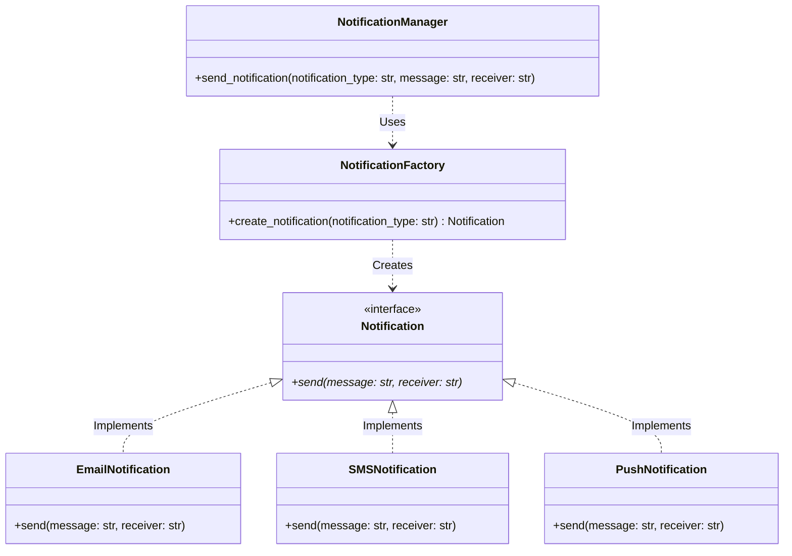

```mermaid
classDiagram
    class NotificationManager {
        +send_notification(notification_type: str, message: str, receiver: str)
    }
    class Notification {
        <<interface>>
        +send(message: str, receiver: str)*
    }
    class EmailNotification {
        +send(message: str, receiver: str)
    }
    class SMSNotification {
        +send(message: str, receiver: str)
    }
    class PushNotification {
        +send(message: str, receiver: str)
    }
    class NotificationFactory {
        +create_notification(notification_type: str) Notification
    }

    Notification <|.. EmailNotification : Implements
    Notification <|.. SMSNotification : Implements
    Notification <|.. PushNotification : Implements
    NotificationFactory ..> Notification : Creates
    NotificationManager ..> NotificationFactory : Uses
```
