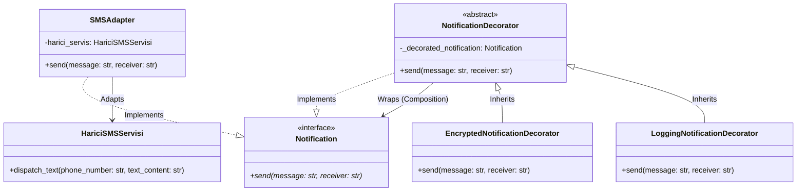

# Faz 2 - Yapısal Örüntüler (Structural) UML Sınıf Diyagramı

```mermaid
classDiagram
    %% Existing Core Structure
    class Notification {
        <<interface>>
        +send(message: str, receiver: str)*
    }

    %% --- ADAPTER PATTERN ---
    class HariciSMSServisi {
        +dispatch_text(phone_number: str, text_content: str)
    }

    class SMSAdapter {
        -harici_servis: HariciSMSServisi
        +send(message: str, receiver: str)
    }

    %% --- DECORATOR PATTERN ---
    class NotificationDecorator {
        <<abstract>>
        -_decorated_notification: Notification
        +send(message: str, receiver: str)
    }

    class EncryptedNotificationDecorator {
        +send(message: str, receiver: str)
    }

    class LoggingNotificationDecorator {
        +send(message: str, receiver: str)
    }

    %% Relationships
    SMSAdapter ..|> Notification : Implements
    SMSAdapter --> HariciSMSServisi : Adapts

    NotificationDecorator ..|> Notification : Implements
    NotificationDecorator --> Notification : Wraps (Composition)
    NotificationDecorator <|-- EncryptedNotificationDecorator : Inherits
    NotificationDecorator <|-- LoggingNotificationDecorator : Inherits

```
