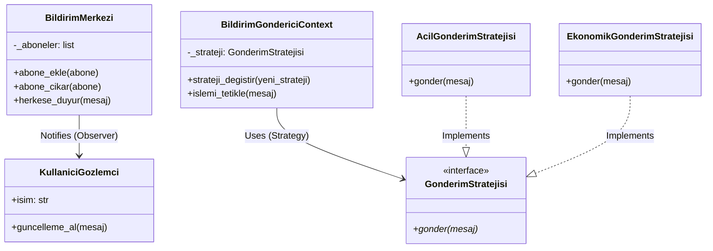

# Faz 3 - Davranışsal Örüntüler (Behavioral) UML Sınıf Diyagramı

```mermaid
classDiagram
    %% --- OBSERVER PATTERN ---
    class BildirimMerkezi {
        -_aboneler: list
        +abone_ekle(abone)
        +abone_cikar(abone)
        +herkese_duyur(mesaj)
    }
    class KullaniciGozlemci {
        +isim: str
        +guncelleme_al(mesaj)
    }

    %% --- STRATEGY PATTERN ---
    class GonderimStratejisi {
        <<interface>>
        +gonder(mesaj)*
    }
    class AcilGonderimStratejisi {
        +gonder(mesaj)
    }
    class EkonomikGonderimStratejisi {
        +gonder(mesaj)
    }
    class BildirimGondericiContext {
        -_strateji: GonderimStratejisi
        +strateji_degistir(yeni_strateji)
        +islemi_tetikle(mesaj)
    }

    %% Relationships
    BildirimMerkezi --> KullaniciGozlemci : Notifies (Observer)
    BildirimGondericiContext --> GonderimStratejisi : Uses (Strategy)
    AcilGonderimStratejisi ..|> GonderimStratejisi : Implements
    EkonomikGonderimStratejisi ..|> GonderimStratejisi : Implements
```
